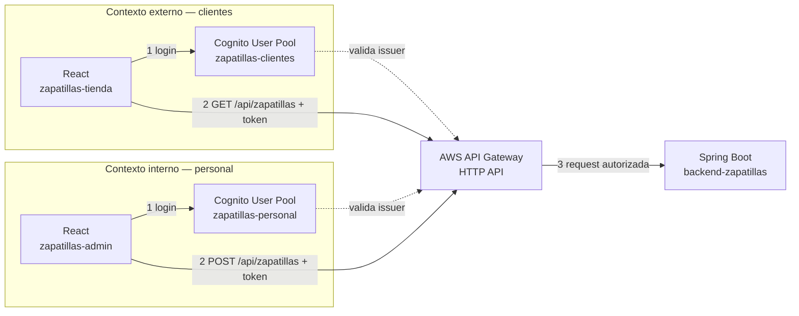

# Guía de Actividad — Inventario de Zapatillas: API Gateway + Cognito (Interno y Externo)

> **Qué es esto:** una actividad con backend y frontend propios (no un tercero como PokeAPI). Construyes un mini sistema de inventario de zapatillas con **Spring Boot** (backend) y **dos apps React** (una para clientes, una para personal), protegido por **un solo AWS API Gateway** y **dos Cognito User Pools** separados.

## El flujo completo, de un vistazo



Ambos frontends llaman al **mismo** API Gateway y al **mismo** backend. Lo único que cambia entre "cliente" y "personal" es qué Cognito User Pool emitió el token, y qué Authorizer lo exige en cada ruta.

**Antes de empezar — checklist:**

- [ ] Acceso a la consola de AWS (Academy Learner Lab u otra) con permisos sobre Cognito y API Gateway.
- [ ] Node.js y npm instalados (para los dos proyectos React).
- [ ] Java 17+ y Maven (o el wrapper `./mvnw`) para el proyecto Spring Boot.
- [ ] Postman instalado.
- [ ] Cuenta gratuita en [ngrok](https://ngrok.com) — la necesitas para que API Gateway pueda llamar a tu backend mientras corre en tu notebook (más detalles en el Contexto 2).
- [ ] Un bloque de 90-120 minutos — son varias piezas, mejor sin interrupciones largas.

---

## Contexto 0 — Proyectos base (Spring Boot + 2 React)

**Qué estamos haciendo y por qué:** antes de tocar AWS necesitamos algo real que proteger. El inventario de zapatillas es la excusa — la lógica de negocio es mínima a propósito, porque el foco de esta actividad es API Gateway y Cognito, no Spring ni React en sí.

### 0.1 — Backend Spring Boot (`backend-shoes-app`) — ya generado

El backend no lo construyes tú — te lo entrego listo (`backend-shoes-app.zip`), porque no es el foco de esta actividad. Trae:

- CRUD completo sobre `/api/zapatillas` (`GET`, `GET /{id}`, `POST`, `PUT /{id}`, `DELETE /{id}`), en memoria (sin base de datos).
- 3 zapatillas de ejemplo precargadas al arrancar.
- Manejo de errores (404 si el id no existe, 400 si faltan campos).
- CORS habilitado para `localhost:5173` y `localhost:5174` (los dos frontends).
- Sin seguridad todavía — eso se agrega en el Contexto de integración final, del lado de API Gateway.

**Pasos:**

1. Descomprime `backend-shoes-app.zip`.
2. Dentro de la carpeta: `mvn spring-boot:run`.
3. Prueba en Postman contra `http://localhost:8080/api/zapatillas` (o con `curl` — ver el `README.md` del proyecto).

**Checkpoint:** `GET` te devuelve las 3 zapatillas de ejemplo. Un `POST` agrega una nueva y aparece en el siguiente `GET`.

**Nota de verificación:** este proyecto se escribió y se revisó a mano siguiendo las convenciones estándar de Spring Boot 3.3, pero no se pudo compilar dentro de este entorno (Maven Central está bloqueado desde acá). Tu `mvn spring-boot:run` del paso 2 es la primera prueba real — si algo no compila, pégame el error y lo corrijo de inmediato.

**Si `mvn` no te aparece como comando:** instálalo con `brew install maven` (o si no tienes Homebrew, instálalo primero desde [brew.sh](https://brew.sh)). Alternativa sin terminal: abre la carpeta como proyecto en IntelliJ IDEA Community o VS Code con la extensión de Java — el IDE trae su propio Maven, solo dale Run a `BackendShoesAppApplication.java`.

### 0.2 — Frontend `zapatillas-tienda` (clientes) — ya generado

Igual que el backend, este frontend también viene listo (`zapatillas-tienda.zip`), ya compilado y verificado. Descomprime, `npm install`, copia `.env.example` a `.env` y completa con los datos del Contexto Cognito externo. `npm run dev` → queda en `http://localhost:5173`.

Pantalla: botón de login (Amplify) y, ya logueado, el catálogo en tarjetas pidiendo `GET /api/zapatillas`.

### 0.3 — Frontend `zapatillas-admin` (personal) — ya generado

Mismo caso: `zapatillas-admin.zip` ya generado y verificado. Descomprime, `npm install`, `.env` con los datos del Contexto Cognito interno. `npm run dev` → queda en `http://localhost:5174`.

Pantalla: botón de login y, ya logueado, un formulario (modelo, marca, talla, stock) que hace `POST /api/zapatillas`.

**Por qué dos proyectos React y no uno:** AWS Amplify configura **un** Cognito User Pool por app (`Amplify.configure()` recibe una sola configuración). Como vamos a tener dos identidades distintas, separar los proyectos evita pelear con Amplify — y de paso refleja cómo se separa esto en un sistema real (portal de administración vs. tienda pública casi nunca son la misma aplicación).

---

## Contexto API Manager (AWS API Gateway — HTTP API)

**Qué estamos haciendo y por qué:** construimos la puerta de entrada antes de protegerla. Probamos primero que API Gateway puede hablar con tu backend Spring Boot **sin Cognito de por medio** — así, si algo falla más adelante, sabes que no es un problema de esta parte. Usamos **solo HTTP API** (no REST API): es el tipo de API más moderno y simple de AWS, y evita un problema real de las cuentas de AWS Academy — REST API exige crear un rol de IAM a nivel de cuenta para el logging, y esas cuentas bloquean la creación de roles personalizados. HTTP API no necesita ese rol.

### 1.1 — Exponer tu backend local a internet (necesario para probar en vivo)

API Gateway corre en la nube de AWS — no puede llamar a `http://localhost:8080` en tu notebook. Mientras desarrollas, usa un túnel:

```bash
ngrok http 8080
```

Ngrok te entrega una URL pública, algo como `https://a1b2-c3d4.ngrok-free.app`. Esa es la URL que API Gateway va a usar como destino. **Anótala** — cambia cada vez que reinicies ngrok (en el plan gratis).

**Antes de la primera vez**, ngrok te va a pedir cuenta y authtoken (una sola vez):

1. Cuenta gratis: https://dashboard.ngrok.com/signup
2. Copia tu authtoken: https://dashboard.ngrok.com/get-started/your-authtoken
3. `ngrok config add-authtoken TU_TOKEN_AQUI`

**Si abres esa URL directo en el navegador**, primero vas a ver una pantalla de advertencia de ngrok ("You are about to visit...") — clic en "Visit Site" para pasar. Es normal, no es un error, y no le aparece a API Gateway cuando la llama (solo se la muestra a navegadores). En Postman, si te aparece, agrega el header `ngrok-skip-browser-warning: true`.

### 1.2 — Crear la HTTP API

1. Consola AWS → busca "API Gateway" → **Create API** → tarjeta **HTTP API** → **Build**.
2. **API name:** `api-zapatillas` → **Next**.
3. En **Configure routes**, la consola te pide crear la integración al mismo tiempo que cada ruta (no se puede agregar una ruta sin integración) — agrega las dos:
   - **Ruta 1:** Método `GET` · Path `/api/zapatillas` · integración nueva tipo **HTTP**, método `GET`, URL = tu URL de ngrok + `/api/zapatillas` (ej. `https://a1b2-c3d4.ngrok-free.app/api/zapatillas`).
   - **Ruta 2:** Método `POST` · Path `/api/zapatillas` · integración nueva tipo **HTTP**, método `POST`, misma URL de ngrok + `/api/zapatillas`.
4. **Next** → deja el stage por defecto (`$default`, con auto-deploy activado) → **Create**.

**Por qué dos rutas con el mismo path:** en API Gateway (y en REST en general) una ruta es la combinación **método + path**, no solo el path. `GET /api/zapatillas` y `POST /api/zapatillas` son dos rutas distintas aunque el texto se vea igual — por eso más adelante cada una puede tener su propio Authorizer (Cognito externo para `GET`, interno para `POST`), sin necesitar nombres de ruta distintos.

### 1.3 — Probar sin autenticación (todavía)

1. Panel izquierdo → **Stages** (o el resumen de tu API) → copia la **Invoke URL** (ej. `https://xyz123.execute-api.us-east-1.amazonaws.com`).
2. En Postman, prueba:
   - `GET {Invoke URL}/api/zapatillas` → debería traer el catálogo.
   - `POST {Invoke URL}/api/zapatillas` → debería agregar un par.

**Checkpoint:** ambas rutas responden igual que cuando las llamabas directo a `localhost:8080`. Todavía cualquiera puede llamarlas — eso se cierra en el Contexto de integración final.

---

## Contexto Cognito — usuarios externos (clientes)

**Tecnología AWS:** Amazon Cognito (User Pool).

**Qué estamos haciendo y por qué:** este es el patrón CIAM del módulo 1.2 — clientes de la tienda, a escala, autogestionando su propia cuenta (se registran solos, recuperan su contraseña solos). El pool que creamos acá solo le habla a `zapatillas-tienda`.

### 2.1 — Crear el User Pool

1. Consola AWS → busca "Cognito" → **User pools** → **Create user pool**.
2. **Define your application:**
   - **Application type:** **Single-page application (SPA)** — es el tipo correcto para un cliente público como React (no genera client secret).
   - **Name your application:** `zapatillas-tienda-app`.
   - **Options:** método de inicio de sesión **Email**.
3. **Add a return URL:** `http://localhost:5173/` (puerto de Vite).
4. **Create your application.** Cognito crea el User Pool y el App Client con esa configuración.

### 2.2 — La pantalla "Set up resources for your application"

Al terminar, Cognito te lleva a esta pantalla — la misma que te generó dudas:

- **"Check out your sign-in page"** → botón **View login page**: abre la pantalla de login real (Managed Login) para que la veas funcionando ahora mismo, con un usuario de prueba.
- **"Build authentication components for your application" → Quick setup guide** → te pregunta **"What's the development platform for your web application?"**, con opciones **Golang / Java / NodeJS / Python**.

**Esto confundía porque parece pedir el lenguaje de tu frontend, pero no es así:** esas 4 opciones son lenguajes de **backend** — esta sección te genera código de ejemplo para validar tokens de Cognito **desde un servidor**, no desde React. No la necesitamos: nuestro backend Spring Boot ya sabe validar tokens de Cognito de forma nativa con Spring Security (lo vas a configurar en el módulo de integración con el backend), y nuestro frontend usa Amplify, no el código de ejemplo de esta pantalla.

**Qué hacer con esta pantalla:** puedes ignorarla y salir (no hay que completarla ni elegir ninguna opción), o si tienes curiosidad, elige **Java** — igual coincide con Spring Boot y te muestra cómo se ve un validador de JWT hecho a mano, útil como referencia, pero no lo vamos a seguir al pie de la letra.

### 2.3 — Dónde sacar el User Pool ID y el App Client ID

- **User Pool ID:** tu User Pool → pestaña **"Overview"** → campo **"User pool ID"** (formato `us-east-1_XXXXXXXXX`).
- **App Client ID:** panel izquierdo, sección **"Applications"** → **"App clients"** → entra a `zapatillas-tienda-app` → arriba aparece el **"Client ID"**.

### 2.4 — Dominio (Managed Login)

1. Panel izquierdo → **"Branding"** → **"Domain"**.
2. Si no quedó asignado durante el asistente, crea uno: prefijo único, ej. `zapatillas-tienda-2026`.
3. Anota el dominio completo: `https://zapatillas-tienda-2026.auth.<region>.amazoncognito.com` — es el que usa el flujo OAuth (login, `/oauth2/authorize`, `/oauth2/token`), no es la URL de tu API.

### 2.5 — Resource server y scope de lectura

1. Busca **"Resource servers"** en el panel izquierdo del User Pool (agrupado bajo Branding/Domain en algunas versiones de consola — usa el buscador si no lo ves a la vista) → **"Create resource server"**.
2. **Resource server identifier:** `zapatillas-api`.
3. **Custom scope → Name:** `read` · **Description:** "Permite consultar el catálogo de zapatillas".
4. Guarda. El scope completo que vas a usar más adelante es `zapatillas-api/read`.
5. Vuelve a **"App clients"** → `zapatillas-tienda-app` → pestaña de login (**"Login pages"**) → **Edit** → en **Custom scopes**, marca `zapatillas-api/read` (y deja `openid`, `email`, `profile` marcados) → **Save changes**.

**Checkpoint del contexto externo:** tienes User Pool ID, App Client ID, dominio, y el scope `zapatillas-api/read` habilitado.

---

## Contexto Cognito — usuarios internos (personal)

**Tecnología AWS:** Amazon Cognito (User Pool) — el mismo servicio que en el contexto anterior, un pool completamente distinto.

**Qué estamos haciendo y por qué:** este representa el patrón IDaaS del módulo 1.2 (identidad de empleados), pero con la misma tecnología que el CIAM — la diferencia está en la configuración y en quién se inscribe (personal de la tienda, no clientes), no en el producto de AWS. Este pool solo le habla a `zapatillas-admin`.

### 3.1 — Crear el User Pool

Repite exactamente el procedimiento del Contexto anterior (2.1), con estos valores distintos:

- **Name your application:** `zapatillas-admin-app`.
- **Return URL:** `http://localhost:5174/` (usa un puerto distinto al de `zapatillas-tienda` para poder correr ambos frontends a la vez — configúralo en el `vite.config.ts` de `zapatillas-admin` con `server: { port: 5174 }`).

### 3.2 — La misma pantalla "Set up resources"

Igual que en 2.2 — puedes ignorarla o elegir **Java** como referencia.

### 3.3 — User Pool ID, App Client ID y dominio

Mismo procedimiento que 2.3 y 2.4, para este pool. Ej. dominio `zapatillas-admin-2026.auth.<region>.amazoncognito.com`.

### 3.4 — Resource server y scope de escritura

1. **Resource server identifier:** `zapatillas-api` (puedes reutilizar el mismo nombre — vive en un User Pool distinto, no hay conflicto).
2. **Custom scope → Name:** `write` · **Description:** "Permite agregar stock al inventario".
3. Habilita `zapatillas-api/write` en `zapatillas-admin-app` (mismo paso que 2.5.5).

**Checkpoint del contexto interno:** tienes User Pool ID, App Client ID, dominio, y el scope `zapatillas-api/write` habilitado — todo en un pool **separado** del de clientes.

---

## Contexto Amplify — conectar cada React a su pool

**Qué estamos haciendo y por qué:** cada app React se configura con `Amplify.configure()` apuntando **solo** a su propio pool. Por eso separamos los proyectos desde el Contexto 0 — Amplify no está pensado para manejar dos identidades independientes en la misma app.

### 4.1 — `zapatillas-tienda` → pool externo

```bash
cd zapatillas-tienda
npm install aws-amplify
```

`.env` en la raíz:

```
VITE_COGNITO_USER_POOL_ID=<User Pool ID de 2.3>
VITE_COGNITO_CLIENT_ID=<App Client ID de 2.3>
VITE_COGNITO_DOMAIN=zapatillas-tienda-2026.auth.us-east-1.amazoncognito.com
VITE_REDIRECT_SIGN_IN=http://localhost:5173/
VITE_REDIRECT_SIGN_OUT=http://localhost:5173/
VITE_API_URL=<Invoke URL de tu API Gateway>
```

`src/main.tsx`, antes de renderizar `<App />`:

```tsx
import { Amplify } from "aws-amplify";

Amplify.configure({
  Auth: {
    Cognito: {
      userPoolId: import.meta.env.VITE_COGNITO_USER_POOL_ID,
      userPoolClientId: import.meta.env.VITE_COGNITO_CLIENT_ID,
      loginWith: {
        oauth: {
          domain: import.meta.env.VITE_COGNITO_DOMAIN,
          scopes: ["openid", "email", "profile", "zapatillas-api/read"],
          redirectSignIn: [import.meta.env.VITE_REDIRECT_SIGN_IN],
          redirectSignOut: [import.meta.env.VITE_REDIRECT_SIGN_OUT],
          responseType: "code",
        },
      },
    },
  },
});
```

`src/api.ts` — envuelve tus llamadas para que lleven el token:

```ts
import { fetchAuthSession } from "aws-amplify/auth";

export async function apiFetch(path: string, options: RequestInit = {}) {
  const session = await fetchAuthSession();
  const token = session.tokens?.accessToken?.toString();
  return fetch(`${import.meta.env.VITE_API_URL}${path}`, {
    ...options,
    headers: { ...options.headers, ...(token ? { Authorization: `Bearer ${token}` } : {}) },
  });
}
```

Usa `signInWithRedirect()` / `signOut()` (de `aws-amplify/auth`) para los botones de login/logout, igual que en la guía 1.3.2.

### 4.2 — `zapatillas-admin` → pool interno

Mismo procedimiento, con los datos del Contexto 3 (User Pool ID, App Client ID, dominio `zapatillas-admin-...`), puerto `5174`, y el scope `zapatillas-api/write` en vez de `read`.

**Checkpoint:** cada app, por separado, puede loguear contra su propio pool y mostrar el token en consola (`fetchAuthSession()`).

---

## Contexto de integración final — Authorizers y protección del backend

**Qué estamos haciendo y por qué:** hasta acá, API Gateway deja pasar cualquier llamada. Un Authorizer es el guardia que revisa, antes de dejar pasar la petición, que venga con un token JWT válido del pool correcto — y opcionalmente, con el scope correcto.

### 5.1 — Crear los dos Authorizers

1. Tu API (`api-zapatillas`) → **"Authorization"** → **"Manage authorizers"** → **"Create"**.
2. **Authorizer 1 — externo:**
   - Tipo: **JWT**. Nombre: `cognito-jwt-externo`.
   - **Identity source:** deja el valor por defecto (header `Authorization`).
   - **Issuer URL:** `https://cognito-idp.<region>.amazonaws.com/<User-Pool-ID-externo>`.
   - **Audience:** App Client ID de `zapatillas-tienda-app` (Contexto 2.3).
3. **Authorizer 2 — interno:** mismo procedimiento, con **Issuer URL** y **Audience** del pool interno (Contexto 3.3). Nombre: `cognito-jwt-interno`.

**De dónde sale el Issuer URL (confunde mucho):** tu User Pool → "Overview" → campo **"OpenID Connect configuration URL"**, con forma `https://cognito-idp.<region>.amazonaws.com/<User-Pool-ID>/.well-known/openid-configuration`. El Issuer URL es esa misma URL **sin** el tramo final `/.well-known/openid-configuration`.

### 5.2 — Adjuntar cada Authorizer a su ruta

1. Panel izquierdo → **"Routes"** → selecciona `GET /api/zapatillas` → **"Attach authorizer"** → elige `cognito-jwt-externo`. En **"Authorization scopes"**, agrega `zapatillas-api/read`.
2. Selecciona `POST /api/zapatillas` → **"Attach authorizer"** → elige `cognito-jwt-interno`. En **"Authorization scopes"**, agrega `zapatillas-api/write`.

**Checkpoint:** en la vista de "Routes", cada ruta muestra su Authorizer — ya no dice "None".

### 5.3 — Prueba de punta a punta

1. Corre `zapatillas-tienda` (`npm run dev`, puerto 5173) → Login con Amplify → confirma que el token trae `zapatillas-api/read` (pégalo en jwt.io) → la app lista el catálogo llamando a `apiFetch('/api/zapatillas')`.
2. Corre `zapatillas-admin` (puerto 5174) → Login con Amplify → confirma el scope `zapatillas-api/write` → agrega un par nuevo desde el formulario.
3. Vuelve a `zapatillas-tienda` y refresca — el par agregado por el admin debería aparecer en el catálogo del cliente (ambos hablan con el mismo backend).

**Resultado esperado:**

- Con token válido y scope correcto → `200 OK`.
- Sin token → `401`.
- Con token del pool equivocado (ej. token de cliente intentando `POST`) → `401`/`403`.

### Troubleshooting

| Síntoma                                               | Causa probable                                                                                                                                |
| ----------------------------------------------------- | --------------------------------------------------------------------------------------------------------------------------------------------- |
| `401` siempre, aunque el token se ve válido en jwt.io | Issuer o Audience del Authorizer no coinciden exactamente con el pool/App Client correcto — revisa que no mezclaste el externo con el interno |
| El cliente puede hacer `POST`                         | Revisa que `POST /api/zapatillas` tenga adjuntado `cognito-jwt-interno`, no el externo                                                        |
| `403` con token y scope aparentemente correctos       | El scope pedido en Amplify (`.env`/`main.tsx`) no coincide letra por letra con el habilitado en el App Client                                 |
| API Gateway no llega al backend (502/504)             | La URL de ngrok cambió (reinicia y actualiza la integración) o el backend Spring Boot no está corriendo                                       |

---

## Cierre

Terminaste con: dos identidades separadas (Cognito), un solo punto de entrada (API Gateway), un backend compartido (Spring Boot) que no sabe ni le importa por cuál puerta entró la petición — solo confía en que, si llegó, ya fue autorizada. Ese es exactamente el patrón de **defense in depth** visto en la clase de Arquitecturas Seguras.

## Enlaces oficiales

- Getting started with user pools: https://docs.aws.amazon.com/cognito/latest/developerguide/getting-started-user-pools.html
- Create a new application (flujo actual): https://docs.aws.amazon.com/cognito/latest/developerguide/getting-started-user-pools-application.html
- Resource servers y scopes personalizados: https://docs.aws.amazon.com/cognito/latest/developerguide/cognito-user-pools-define-resource-servers.html
- HTTP API — integraciones HTTP: https://docs.aws.amazon.com/apigateway/latest/developerguide/http-api-develop-integrations-http.html
- HTTP API JWT Authorizer: https://docs.aws.amazon.com/apigateway/latest/developerguide/http-api-jwt-authorizer.html
- Amplify — Use existing Cognito resources (React): https://docs.amplify.aws/react/build-a-backend/auth/use-existing-cognito-resources/
- ngrok — Getting started: https://ngrok.com/docs/getting-started/
