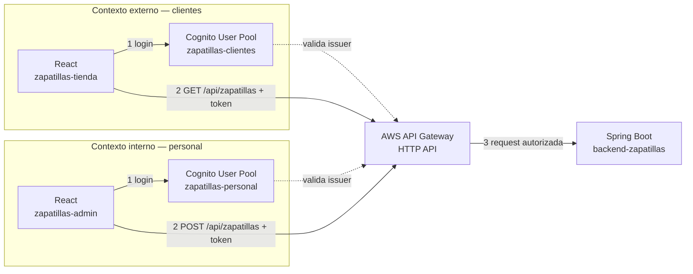

# Guía de Actividad — Inventario de Zapatillas: API Gateway + Cognito (Interno y Externo)

> **Qué es esto:** una actividad con backend y frontend propios (no un tercero como PokeAPI). Vas a construir un mini sistema de inventario de zapatillas con **Spring Boot** (backend) y **dos apps React** (una para clientes, una para personal), protegido por **un solo AWS API Gateway** y **dos Cognito User Pools** separados.

## El flujo completo, de un vistazo



Ambos frontends llaman al **mismo** API Gateway y al **mismo** backend. Lo único que cambia entre "cliente" y "personal" es qué Cognito User Pool emitió el token, y qué Authorizer lo exige en cada ruta.

**Antes de empezar — checklist:**

- [ ] Acceso a la consola de AWS (Academy Learner Lab u otra) con permisos sobre Cognito y API Gateway.
- [ ] Node.js y npm instalados.
- [ ] Java 17+ y Maven instalados (`java -version`, `mvn -version`).
- [ ] Postman instalado.
- [ ] Cuenta gratuita en [ngrok](https://ngrok.com) — la necesitas para que API Gateway pueda llamar a tu backend mientras corre en tu notebook.
- [ ] **Windows:** instala [Git for Windows](https://git-scm.com/downloads/win) y usa "Git Bash" como terminal para los comandos de esta guía — es la forma más simple de que todo funcione igual que en Mac/Linux. (Alternativa: PowerShell funciona para casi todo, pero algunos comandos de ejemplo con `curl` necesitan ajustes — se indica en el paso correspondiente.)
- [ ] Un bloque de 2-3 horas — son varias piezas, mejor sin interrupciones largas.

---

## Contexto 0 — Construir los proyectos base (Spring Boot + 2 React)

**Qué estamos haciendo y por qué:** antes de tocar AWS necesitamos algo real que proteger. El inventario de zapatillas es la excusa — la lógica de negocio es intencionalmente simple, porque el foco de esta actividad es API Gateway y Cognito, no Spring ni React en profundidad.

### 0.1 — Backend Spring Boot (`backend-shoes-app`)

**Paso 1 — Crear el proyecto**

1. Ve a [start.spring.io](https://start.spring.io).
2. Configura: **Project:** Maven · **Language:** Java · **Spring Boot:** la versión estable más reciente de la rama 3.3.x · **Group:** `cl.duoc` · **Artifact:** `backend-shoes-app` · **Packaging:** Jar · **Java:** 17.
3. En **Dependencies**, agrega **Spring Web** y **Validation**.
4. **Generate** → descarga y descomprime el proyecto.

**Si `mvn` no te aparece como comando:**

- **Mac:** instálalo con `brew install maven` (o instala Homebrew primero desde [brew.sh](https://brew.sh) si no lo tienes).
- **Windows:** instálalo con `winget install Apache.Maven` (Windows 10/11 trae `winget` por defecto), o descárgalo manualmente desde [maven.apache.org](https://maven.apache.org/download.cgi) y agrégalo al `PATH`.
- **Alternativa sin terminal, en cualquier sistema operativo:** abre la carpeta como proyecto en IntelliJ IDEA Community o VS Code con la extensión de Java — el IDE trae su propio Maven y le puedes dar "Run" directo al método `main`.

**Paso 2 — El modelo de datos**

Crea `src/main/java/cl/duoc/backendshoesapp/model/Zapatilla.java`:

```java
package cl.duoc.backendshoesapp.model;

import jakarta.validation.constraints.Min;
import jakarta.validation.constraints.NotBlank;
import jakarta.validation.constraints.NotNull;

public class Zapatilla {

    private Long id;

    @NotBlank(message = "El modelo es obligatorio")
    private String modelo;

    @NotBlank(message = "La marca es obligatoria")
    private String marca;

    @NotNull(message = "La talla es obligatoria")
    @Min(value = 30, message = "La talla debe ser un número de calzado válido")
    private Integer talla;

    @NotNull(message = "El stock es obligatorio")
    @Min(value = 0, message = "El stock no puede ser negativo")
    private Integer stock;

    public Zapatilla() {
    }

    public Zapatilla(Long id, String modelo, String marca, Integer talla, Integer stock) {
        this.id = id;
        this.modelo = modelo;
        this.marca = marca;
        this.talla = talla;
        this.stock = stock;
    }

    public Long getId() { return id; }
    public void setId(Long id) { this.id = id; }
    public String getModelo() { return modelo; }
    public void setModelo(String modelo) { this.modelo = modelo; }
    public String getMarca() { return marca; }
    public void setMarca(String marca) { this.marca = marca; }
    public Integer getTalla() { return talla; }
    public void setTalla(Integer talla) { this.talla = talla; }
    public Integer getStock() { return stock; }
    public void setStock(Integer stock) { this.stock = stock; }
}
```

**Paso 3 — El servicio (guarda el inventario en memoria)**

Crea `src/main/java/cl/duoc/backendshoesapp/service/ZapatillaNoEncontradaException.java`:

```java
package cl.duoc.backendshoesapp.service;

public class ZapatillaNoEncontradaException extends RuntimeException {
    public ZapatillaNoEncontradaException(Long id) {
        super("No existe una zapatilla con id " + id);
    }
}
```

Crea `src/main/java/cl/duoc/backendshoesapp/service/ZapatillaService.java`:

```java
package cl.duoc.backendshoesapp.service;

import cl.duoc.backendshoesapp.model.Zapatilla;
import jakarta.annotation.PostConstruct;
import org.springframework.stereotype.Service;

import java.util.List;
import java.util.Map;
import java.util.concurrent.ConcurrentHashMap;
import java.util.concurrent.atomic.AtomicLong;
import java.util.stream.Collectors;

@Service
public class ZapatillaService {

    private final Map<Long, Zapatilla> inventario = new ConcurrentHashMap<>();
    private final AtomicLong secuenciaId = new AtomicLong(0);

    @PostConstruct
    public void cargarDatosDeEjemplo() {
        crear(new Zapatilla(null, "Air Runner", "Nortex", 42, 15));
        crear(new Zapatilla(null, "Urban Glide", "Vantix", 39, 8));
        crear(new Zapatilla(null, "Trail Storm", "Nortex", 44, 3));
    }

    public List<Zapatilla> listarTodas() {
        return inventario.values().stream()
                .sorted((a, b) -> Long.compare(a.getId(), b.getId()))
                .collect(Collectors.toList());
    }

    public Zapatilla buscarPorId(Long id) {
        Zapatilla zapatilla = inventario.get(id);
        if (zapatilla == null) {
            throw new ZapatillaNoEncontradaException(id);
        }
        return zapatilla;
    }

    public Zapatilla crear(Zapatilla nueva) {
        long id = secuenciaId.incrementAndGet();
        nueva.setId(id);
        inventario.put(id, nueva);
        return nueva;
    }

    public Zapatilla actualizar(Long id, Zapatilla datos) {
        Zapatilla existente = buscarPorId(id);
        existente.setModelo(datos.getModelo());
        existente.setMarca(datos.getMarca());
        existente.setTalla(datos.getTalla());
        existente.setStock(datos.getStock());
        return existente;
    }

    public void eliminar(Long id) {
        if (!inventario.containsKey(id)) {
            throw new ZapatillaNoEncontradaException(id);
        }
        inventario.remove(id);
    }
}
```

**Paso 4 — El controller (los endpoints REST)**

Crea `src/main/java/cl/duoc/backendshoesapp/controller/ZapatillaController.java`:

```java
package cl.duoc.backendshoesapp.controller;

import cl.duoc.backendshoesapp.model.Zapatilla;
import cl.duoc.backendshoesapp.service.ZapatillaService;
import jakarta.validation.Valid;
import org.springframework.http.HttpStatus;
import org.springframework.web.bind.annotation.*;

import java.util.List;

@RestController
@RequestMapping("/api/zapatillas")
public class ZapatillaController {

    private final ZapatillaService zapatillaService;

    public ZapatillaController(ZapatillaService zapatillaService) {
        this.zapatillaService = zapatillaService;
    }

    @GetMapping
    public List<Zapatilla> listar() {
        return zapatillaService.listarTodas();
    }

    @GetMapping("/{id}")
    public Zapatilla obtener(@PathVariable Long id) {
        return zapatillaService.buscarPorId(id);
    }

    @PostMapping
    @ResponseStatus(HttpStatus.CREATED)
    public Zapatilla crear(@Valid @RequestBody Zapatilla nueva) {
        return zapatillaService.crear(nueva);
    }

    @PutMapping("/{id}")
    public Zapatilla actualizar(@PathVariable Long id, @Valid @RequestBody Zapatilla datos) {
        return zapatillaService.actualizar(id, datos);
    }

    @DeleteMapping("/{id}")
    @ResponseStatus(HttpStatus.NO_CONTENT)
    public void eliminar(@PathVariable Long id) {
        zapatillaService.eliminar(id);
    }
}
```

**Por qué `GET` y `POST` viven en el mismo controller:** ambos comparten el mismo path base (`/api/zapatillas`), solo cambia el método HTTP y qué hace cada uno — igual como se explica más adelante en el Contexto API Manager.

Crea `src/main/java/cl/duoc/backendshoesapp/controller/GlobalExceptionHandler.java` (para que los errores devuelvan JSON en vez de la página blanca de error de Spring):

```java
package cl.duoc.backendshoesapp.controller;

import cl.duoc.backendshoesapp.service.ZapatillaNoEncontradaException;
import org.springframework.http.HttpStatus;
import org.springframework.http.ResponseEntity;
import org.springframework.web.bind.MethodArgumentNotValidException;
import org.springframework.web.bind.annotation.ExceptionHandler;
import org.springframework.web.bind.annotation.RestControllerAdvice;

import java.time.Instant;
import java.util.LinkedHashMap;
import java.util.Map;
import java.util.stream.Collectors;

@RestControllerAdvice
public class GlobalExceptionHandler {

    @ExceptionHandler(ZapatillaNoEncontradaException.class)
    public ResponseEntity<Map<String, Object>> manejarNoEncontrada(ZapatillaNoEncontradaException ex) {
        return ResponseEntity.status(HttpStatus.NOT_FOUND).body(cuerpoError(ex.getMessage()));
    }

    @ExceptionHandler(MethodArgumentNotValidException.class)
    public ResponseEntity<Map<String, Object>> manejarValidacion(MethodArgumentNotValidException ex) {
        String detalle = ex.getBindingResult().getFieldErrors().stream()
                .map(err -> err.getField() + ": " + err.getDefaultMessage())
                .collect(Collectors.joining(", "));
        return ResponseEntity.status(HttpStatus.BAD_REQUEST).body(cuerpoError(detalle));
    }

    private Map<String, Object> cuerpoError(String mensaje) {
        Map<String, Object> cuerpo = new LinkedHashMap<>();
        cuerpo.put("timestamp", Instant.now().toString());
        cuerpo.put("mensaje", mensaje);
        return cuerpo;
    }
}
```

**Paso 5 — Habilitar CORS (para que los dos React puedan llamarlo directo mientras desarrollas)**

Crea `src/main/java/cl/duoc/backendshoesapp/config/CorsConfig.java`:

```java
package cl.duoc.backendshoesapp.config;

import org.springframework.context.annotation.Configuration;
import org.springframework.web.servlet.config.annotation.CorsRegistry;
import org.springframework.web.servlet.config.annotation.WebMvcConfigurer;

@Configuration
public class CorsConfig implements WebMvcConfigurer {

    @Override
    public void addCorsMappings(CorsRegistry registry) {
        registry.addMapping("/api/**")
                .allowedOrigins("http://localhost:5173", "http://localhost:5174")
                .allowedMethods("GET", "POST", "PUT", "DELETE", "OPTIONS")
                .allowedHeaders("*");
    }
}
```

**Paso 6 — Correr y probar**

```bash
mvn spring-boot:run
```

Prueba en Postman o con `curl` (recomendado: Postman, funciona igual en cualquier sistema operativo):

```bash
curl http://localhost:8080/api/zapatillas

curl -X POST http://localhost:8080/api/zapatillas \
  -H "Content-Type: application/json" \
  -d '{"modelo":"Sky Jump","marca":"Nortex","talla":41,"stock":10}'
```

**Si usas `curl` en Windows:** en Git Bash el comando de arriba funciona tal cual. En PowerShell o cmd, el `\` de continuación de línea no funciona — escríbelo en una sola línea:

```
curl -X POST http://localhost:8080/api/zapatillas -H "Content-Type: application/json" -d "{\"modelo\":\"Sky Jump\",\"marca\":\"Nortex\",\"talla\":41,\"stock\":10}"
```

**Checkpoint:** `GET` te devuelve las 3 zapatillas de ejemplo. Un `POST` agrega una nueva y aparece en el siguiente `GET`. Todavía **sin seguridad** — eso se agrega del lado de API Gateway en el Contexto de integración final; este backend no necesita saber nada de Cognito, confía en que si la petición llegó, ya fue autorizada por el Gateway.

### 0.2 — Frontend `zapatillas-tienda` (clientes)

**Paso 1 — Crear el proyecto**

```bash
npm create vite@latest zapatillas-tienda -- --template react-ts
cd zapatillas-tienda
npm install
npm install aws-amplify
```

**Paso 2 — Fijar el puerto**

Edita `vite.config.ts`:

```ts
import react from "@vitejs/plugin-react";
import { defineConfig } from "vite";

export default defineConfig({
  plugins: [react()],
  server: {
    port: 5173,
  },
});
```

**Paso 3 — Variables de entorno**

Crea `.env.example` en la raíz:

```
VITE_COGNITO_USER_POOL_ID=
VITE_COGNITO_CLIENT_ID=
VITE_COGNITO_DOMAIN=
VITE_REDIRECT_SIGN_IN=http://localhost:5173/
VITE_REDIRECT_SIGN_OUT=http://localhost:5173/
VITE_API_URL=
```

Cópialo a `.env` (agrega `.env` a tu `.gitignore`) — lo completas en el Contexto Cognito externo, más adelante.

**Paso 4 — Leer y validar la configuración**

Crea `src/config.ts`:

```ts
export const config = {
  userPoolId: import.meta.env.VITE_COGNITO_USER_POOL_ID as string | undefined,
  userPoolClientId: import.meta.env.VITE_COGNITO_CLIENT_ID as string | undefined,
  domain: import.meta.env.VITE_COGNITO_DOMAIN as string | undefined,
  redirectSignIn: import.meta.env.VITE_REDIRECT_SIGN_IN as string | undefined,
  redirectSignOut: import.meta.env.VITE_REDIRECT_SIGN_OUT as string | undefined,
  apiUrl: import.meta.env.VITE_API_URL as string | undefined,
};

export function configFaltante(): string[] {
  return Object.entries(config)
    .filter(([, value]) => !value)
    .map(([key]) => key);
}

export const isConfigOk = configFaltante().length === 0;
```

**Paso 5 — Configurar Amplify**

Reemplaza `src/main.tsx`:

```tsx
import { StrictMode } from "react";
import { createRoot } from "react-dom/client";
import { Amplify } from "aws-amplify";
import "./index.css";
import App from "./App.tsx";
import { config, isConfigOk } from "./config";

if (isConfigOk) {
  Amplify.configure({
    Auth: {
      Cognito: {
        userPoolId: config.userPoolId!,
        userPoolClientId: config.userPoolClientId!,
        loginWith: {
          oauth: {
            domain: config.domain!,
            scopes: ["openid", "email", "profile", "zapatillas-api/read"],
            redirectSignIn: [config.redirectSignIn!],
            redirectSignOut: [config.redirectSignOut!],
            responseType: "code",
          },
        },
      },
    },
  });
}

createRoot(document.getElementById("root")!).render(
  <StrictMode>
    <App />
  </StrictMode>,
);
```

**Paso 6 — El wrapper para llamadas autenticadas**

Crea `src/api.ts`:

```ts
import { fetchAuthSession } from "aws-amplify/auth";
import { config } from "./config";

export interface Zapatilla {
  id: number;
  modelo: string;
  marca: string;
  talla: number;
  stock: number;
}

export async function apiFetch(path: string, options: RequestInit = {}): Promise<Response> {
  const session = await fetchAuthSession();
  const token = session.tokens?.accessToken?.toString();

  return fetch(`${config.apiUrl}${path}`, {
    ...options,
    headers: {
      "Content-Type": "application/json",
      ...options.headers,
      ...(token ? { Authorization: `Bearer ${token}` } : {}),
    },
  });
}

export async function obtenerCatalogo(): Promise<Zapatilla[]> {
  const res = await apiFetch("/api/zapatillas");
  if (!res.ok) {
    throw new Error(`El backend respondió ${res.status} al pedir el catálogo`);
  }
  return res.json();
}
```

**Paso 7 — La pantalla**

Reemplaza `src/App.tsx`:

```tsx
import { useEffect, useState } from "react";
import { signInWithRedirect, signOut, fetchAuthSession } from "aws-amplify/auth";
import { obtenerCatalogo, type Zapatilla } from "./api";
import { isConfigOk, configFaltante } from "./config";
import "./App.css";

function App() {
  const [logueado, setLogueado] = useState(false);
  const [cargandoSesion, setCargandoSesion] = useState(true);
  const [catalogo, setCatalogo] = useState<Zapatilla[]>([]);
  const [cargandoCatalogo, setCargandoCatalogo] = useState(false);
  const [error, setError] = useState<string | null>(null);

  useEffect(() => {
    if (!isConfigOk) {
      setCargandoSesion(false);
      return;
    }
    fetchAuthSession()
      .then((session) => setLogueado(!!session.tokens))
      .catch(() => setLogueado(false))
      .finally(() => setCargandoSesion(false));
  }, []);

  useEffect(() => {
    if (!logueado) return;
    setCargandoCatalogo(true);
    setError(null);
    obtenerCatalogo()
      .then(setCatalogo)
      .catch((err) => setError(err.message))
      .finally(() => setCargandoCatalogo(false));
  }, [logueado]);

  if (!isConfigOk) {
    return (
      <div className="aviso-config">
        <h1>Falta configuración</h1>
        <p>
          Completa estos valores en <code>.env</code> (Contexto Cognito externo):
        </p>
        <ul>
          {configFaltante().map((clave) => (
            <li key={clave}>
              <code>{clave}</code>
            </li>
          ))}
        </ul>
      </div>
    );
  }

  return (
    <div className="app">
      <header className="app-header">
        <h1>Zapatillas — Tienda</h1>
        {!cargandoSesion &&
          (logueado ? (
            <button onClick={() => signOut()}>Cerrar sesión</button>
          ) : (
            <button onClick={() => signInWithRedirect()}>Iniciar sesión</button>
          ))}
      </header>

      {cargandoSesion && <p>Verificando sesión…</p>}
      {!cargandoSesion && !logueado && <p className="mensaje">Inicia sesión como cliente para ver el catálogo.</p>}

      {logueado && (
        <main>
          {cargandoCatalogo && <p>Cargando catálogo…</p>}
          {error && <p className="error">Error al cargar el catálogo: {error}</p>}
          {!cargandoCatalogo && !error && catalogo.length === 0 && (
            <p className="mensaje">No hay zapatillas en el inventario todavía.</p>
          )}
          <div className="grid-catalogo">
            {catalogo.map((z) => (
              <article key={z.id} className="tarjeta">
                <h2>{z.modelo}</h2>
                <p className="marca">{z.marca}</p>
                <p>Talla: {z.talla}</p>
                <p className={z.stock > 0 ? "stock-ok" : "stock-agotado"}>
                  {z.stock > 0 ? `${z.stock} en stock` : "Agotado"}
                </p>
              </article>
            ))}
          </div>
        </main>
      )}
    </div>
  );
}

export default App;
```

Reemplaza `src/App.css`:

```css
.app {
  max-width: 960px;
  margin: 0 auto;
  padding: 24px;
}
.app-header {
  display: flex;
  align-items: center;
  justify-content: space-between;
  border-bottom: 1px solid #ddd;
  padding-bottom: 16px;
  margin-bottom: 24px;
}
.app-header h1 {
  font-size: 22px;
  margin: 0;
}
button {
  font-size: 14px;
  padding: 8px 16px;
  border-radius: 6px;
  border: 1px solid #333;
  background: #fff;
  cursor: pointer;
}
button:hover {
  background: #f2f2f2;
}
.mensaje {
  color: #555;
}
.error {
  color: #b3261e;
}
.aviso-config {
  max-width: 640px;
  margin: 48px auto;
  padding: 24px;
  border: 1px solid #d9b400;
  background: #fffbe6;
  border-radius: 8px;
}
.grid-catalogo {
  display: grid;
  grid-template-columns: repeat(auto-fill, minmax(200px, 1fr));
  gap: 16px;
}
.tarjeta {
  border: 1px solid #ddd;
  border-radius: 8px;
  padding: 16px;
}
.tarjeta h2 {
  font-size: 16px;
  margin: 0 0 4px;
}
.marca {
  color: #666;
  font-size: 13px;
  margin: 0 0 8px;
}
.stock-ok {
  color: #1f6f2b;
  font-weight: 600;
}
.stock-agotado {
  color: #b3261e;
  font-weight: 600;
}
```

**Checkpoint:** con el `.env` sin completar, `npm run dev` te muestra el aviso de configuración faltante (comportamiento esperado, no un error).

### 0.3 — Frontend `zapatillas-admin` (personal)

Mismo procedimiento que 0.2, con estas diferencias:

1. `npm create vite@latest zapatillas-admin -- --template react-ts`, luego `npm install` y `npm install aws-amplify`.
2. `vite.config.ts` con `port: 5174` (no 5173 — así puedes correr los dos frontends a la vez).
3. `.env.example`:
   ```
   VITE_COGNITO_USER_POOL_ID=
   VITE_COGNITO_CLIENT_ID=
   VITE_COGNITO_DOMAIN=
   VITE_REDIRECT_SIGN_IN=http://localhost:5174/
   VITE_REDIRECT_SIGN_OUT=http://localhost:5174/
   VITE_API_URL=
   ```
4. `src/config.ts` — idéntico al de `zapatillas-tienda`.
5. `src/main.tsx` — idéntico, salvo el scope: usa `'zapatillas-api/write'` en vez de `'zapatillas-api/read'`.
6. `src/api.ts`:

```ts
import { fetchAuthSession } from "aws-amplify/auth";
import { config } from "./config";

export interface Zapatilla {
  id: number;
  modelo: string;
  marca: string;
  talla: number;
  stock: number;
}

export interface NuevaZapatilla {
  modelo: string;
  marca: string;
  talla: number;
  stock: number;
}

export async function apiFetch(path: string, options: RequestInit = {}): Promise<Response> {
  const session = await fetchAuthSession();
  const token = session.tokens?.accessToken?.toString();

  return fetch(`${config.apiUrl}${path}`, {
    ...options,
    headers: {
      "Content-Type": "application/json",
      ...options.headers,
      ...(token ? { Authorization: `Bearer ${token}` } : {}),
    },
  });
}

export async function agregarZapatilla(datos: NuevaZapatilla): Promise<Zapatilla> {
  const res = await apiFetch("/api/zapatillas", {
    method: "POST",
    body: JSON.stringify(datos),
  });
  if (!res.ok) {
    const cuerpo = await res.json().catch(() => null);
    throw new Error(cuerpo?.mensaje ?? `El backend respondió ${res.status} al agregar la zapatilla`);
  }
  return res.json();
}
```

7. `src/App.tsx` — un formulario en vez de un catálogo:

```tsx
import { useEffect, useState, type FormEvent } from "react";
import { signInWithRedirect, signOut, fetchAuthSession } from "aws-amplify/auth";
import { agregarZapatilla, type Zapatilla } from "./api";
import { isConfigOk, configFaltante } from "./config";
import "./App.css";

const FORM_INICIAL = { modelo: "", marca: "", talla: "", stock: "" };

function App() {
  const [logueado, setLogueado] = useState(false);
  const [cargandoSesion, setCargandoSesion] = useState(true);
  const [form, setForm] = useState(FORM_INICIAL);
  const [enviando, setEnviando] = useState(false);
  const [error, setError] = useState<string | null>(null);
  const [agregadas, setAgregadas] = useState<Zapatilla[]>([]);

  useEffect(() => {
    if (!isConfigOk) {
      setCargandoSesion(false);
      return;
    }
    fetchAuthSession()
      .then((session) => setLogueado(!!session.tokens))
      .catch(() => setLogueado(false))
      .finally(() => setCargandoSesion(false));
  }, []);

  if (!isConfigOk) {
    return (
      <div className="aviso-config">
        <h1>Falta configuración</h1>
        <p>
          Completa estos valores en <code>.env</code> (Contexto Cognito interno):
        </p>
        <ul>
          {configFaltante().map((clave) => (
            <li key={clave}>
              <code>{clave}</code>
            </li>
          ))}
        </ul>
      </div>
    );
  }

  async function onSubmit(e: FormEvent) {
    e.preventDefault();
    setError(null);
    setEnviando(true);
    try {
      const nueva = await agregarZapatilla({
        modelo: form.modelo,
        marca: form.marca,
        talla: Number(form.talla),
        stock: Number(form.stock),
      });
      setAgregadas((prev) => [nueva, ...prev]);
      setForm(FORM_INICIAL);
    } catch (err) {
      setError(err instanceof Error ? err.message : "Error desconocido");
    } finally {
      setEnviando(false);
    }
  }

  return (
    <div className="app">
      <header className="app-header">
        <h1>Zapatillas — Panel de Personal</h1>
        {!cargandoSesion &&
          (logueado ? (
            <button onClick={() => signOut()}>Cerrar sesión</button>
          ) : (
            <button onClick={() => signInWithRedirect()}>Iniciar sesión</button>
          ))}
      </header>

      {cargandoSesion && <p>Verificando sesión…</p>}
      {!cargandoSesion && !logueado && <p className="mensaje">Inicia sesión como personal para agregar stock.</p>}

      {logueado && (
        <main>
          <form onSubmit={onSubmit} className="formulario">
            <label>
              Modelo
              <input required value={form.modelo} onChange={(e) => setForm({ ...form, modelo: e.target.value })} />
            </label>
            <label>
              Marca
              <input required value={form.marca} onChange={(e) => setForm({ ...form, marca: e.target.value })} />
            </label>
            <label>
              Talla
              <input
                required
                type="number"
                min={30}
                value={form.talla}
                onChange={(e) => setForm({ ...form, talla: e.target.value })}
              />
            </label>
            <label>
              Stock
              <input
                required
                type="number"
                min={0}
                value={form.stock}
                onChange={(e) => setForm({ ...form, stock: e.target.value })}
              />
            </label>
            <button type="submit" disabled={enviando}>
              {enviando ? "Agregando…" : "Agregar al inventario"}
            </button>
          </form>

          {error && <p className="error">No se pudo agregar: {error}</p>}

          {agregadas.length > 0 && (
            <section>
              <h2>Agregado en esta sesión</h2>
              <ul className="lista-agregadas">
                {agregadas.map((z) => (
                  <li key={z.id}>
                    #{z.id} — {z.modelo} ({z.marca}) · talla {z.talla} · stock {z.stock}
                  </li>
                ))}
              </ul>
            </section>
          )}
        </main>
      )}
    </div>
  );
}

export default App;
```

8. `src/App.css`:

```css
.app {
  max-width: 640px;
  margin: 0 auto;
  padding: 24px;
}
.app-header {
  display: flex;
  align-items: center;
  justify-content: space-between;
  border-bottom: 1px solid #ddd;
  padding-bottom: 16px;
  margin-bottom: 24px;
}
.app-header h1 {
  font-size: 22px;
  margin: 0;
}
button {
  font-size: 14px;
  padding: 8px 16px;
  border-radius: 6px;
  border: 1px solid #333;
  background: #fff;
  cursor: pointer;
}
button:hover {
  background: #f2f2f2;
}
button:disabled {
  opacity: 0.6;
  cursor: default;
}
.mensaje {
  color: #555;
}
.error {
  color: #b3261e;
}
.aviso-config {
  max-width: 640px;
  margin: 48px auto;
  padding: 24px;
  border: 1px solid #d9b400;
  background: #fffbe6;
  border-radius: 8px;
}
.formulario {
  display: flex;
  flex-direction: column;
  gap: 14px;
  max-width: 320px;
}
.formulario label {
  display: flex;
  flex-direction: column;
  gap: 4px;
  font-size: 13px;
  color: #444;
}
.formulario input {
  font-size: 14px;
  padding: 8px 10px;
  border: 1px solid #ccc;
  border-radius: 6px;
}
.formulario button {
  margin-top: 6px;
}
.lista-agregadas {
  list-style: none;
  padding: 0;
  margin: 8px 0 0;
  font-size: 14px;
}
.lista-agregadas li {
  padding: 6px 0;
  border-bottom: 1px solid #eee;
}
```

**Checkpoint:** cada app corre en su puerto (5173 tienda, 5174 admin), ambas muestran el aviso de configuración faltante hasta que completes su `.env` en el Contexto Cognito correspondiente.

**Por qué dos proyectos React y no uno:** AWS Amplify configura **un** Cognito User Pool por app (`Amplify.configure()` recibe una sola configuración). Como vamos a tener dos identidades distintas, separar los proyectos evita pelear con Amplify — y de paso refleja cómo se separa esto en un sistema real (portal de administración vs. tienda pública casi nunca son la misma aplicación).

---

## Contexto API Manager (AWS API Gateway — HTTP API)

**Qué estamos haciendo y por qué:** construimos la puerta de entrada antes de protegerla. Probamos primero que API Gateway puede hablar con tu backend Spring Boot **sin Cognito de por medio** — así, si algo falla más adelante, sabes que no es un problema de esta parte. Usamos **solo HTTP API** (no REST API): es el tipo de API más moderno y simple de AWS, y evita un problema real de las cuentas de AWS Academy — REST API exige crear un rol de IAM a nivel de cuenta para el logging, y esas cuentas bloquean la creación de roles personalizados. HTTP API no necesita ese rol.

### 1.1 — Exponer tu backend local a internet (necesario para probar en vivo)

API Gateway corre en la nube de AWS — no puede llamar a `http://localhost:8080` en tu notebook. Mientras desarrollas, usa un túnel:

```bash
ngrok http 8080
```

Ngrok te entrega una URL pública, algo como `https://a1b2-c3d4.ngrok-free.app`. Esa es la URL que API Gateway va a usar como destino. **Anótala** — cambia cada vez que reinicies ngrok (en el plan gratis).

**Antes de la primera vez**, ngrok te va a pedir cuenta y authtoken (una sola vez):

1. Cuenta gratis: https://dashboard.ngrok.com/signup
2. Copia tu authtoken: https://dashboard.ngrok.com/get-started/your-authtoken
3. `ngrok config add-authtoken TU_TOKEN_AQUI`

**Si abres esa URL directo en el navegador**, primero vas a ver una pantalla de advertencia de ngrok ("You are about to visit...") — clic en "Visit Site" para pasar. Es normal, no es un error, y no le aparece a API Gateway cuando la llama (solo se la muestra a navegadores). En Postman, si te aparece, agrega el header `ngrok-skip-browser-warning: true`.

### 1.2 — Crear la HTTP API

1. Consola AWS → busca "API Gateway" → **Create API** → tarjeta **HTTP API** → **Build**.
2. **API name:** `api-zapatillas` → **Next**.
3. En **Configure routes**, la consola te pide crear la integración al mismo tiempo que cada ruta (no se puede agregar una ruta sin integración) — agrega las dos:
   - **Ruta 1:** Método `GET` · Path `/api/zapatillas` · integración nueva tipo **HTTP**, método `GET`, URL = tu URL de ngrok + `/api/zapatillas` (ej. `https://a1b2-c3d4.ngrok-free.app/api/zapatillas`).
   - **Ruta 2:** Método `POST` · Path `/api/zapatillas` · integración nueva tipo **HTTP**, método `POST`, misma URL de ngrok + `/api/zapatillas`.
4. **Next** → deja el stage por defecto (`$default`, con auto-deploy activado) → **Create**.

**Por qué dos rutas con el mismo path:** en API Gateway (y en REST en general) una ruta es la combinación **método + path**, no solo el path. `GET /api/zapatillas` y `POST /api/zapatillas` son dos rutas distintas aunque el texto se vea igual — por eso más adelante cada una puede tener su propio Authorizer (Cognito externo para `GET`, interno para `POST`), sin necesitar nombres de ruta distintos.

### 1.3 — Probar sin autenticación (todavía)

1. Panel izquierdo → **Stages** (o el resumen de tu API) → copia la **Invoke URL** (ej. `https://xyz123.execute-api.us-east-1.amazonaws.com`).
2. En Postman, prueba:
   - `GET {Invoke URL}/api/zapatillas` → debería traer el catálogo.
   - `POST {Invoke URL}/api/zapatillas` → debería agregar un par.

**Checkpoint:** ambas rutas responden igual que cuando las llamabas directo a `localhost:8080`. Todavía cualquiera puede llamarlas — eso se cierra en el Contexto de integración final.

---

## Contexto Cognito — usuarios externos (clientes)

**Tecnología AWS:** Amazon Cognito (User Pool).

**Qué estamos haciendo y por qué:** este es el patrón CIAM del módulo 1.2 — clientes de la tienda, a escala, autogestionando su propia cuenta (se registran solos, recuperan su contraseña solos). El pool que creamos acá solo le habla a `zapatillas-tienda`.

### 2.1 — Crear el User Pool

1. Consola AWS → busca "Cognito" → **User pools** → **Create user pool**.
2. **Define your application:**
   - **Application type:** **Single-page application (SPA)** — es el tipo correcto para un cliente público como React (no genera client secret).
   - **Name your application:** `zapatillas-tienda-app`.
   - **Options:** método de inicio de sesión **Email**.
3. **Add a return URL:** `http://localhost:5173/` (puerto de Vite).
4. **Create your application.** Cognito crea el User Pool y el App Client con esa configuración.

### 2.2 — La pantalla "Set up resources for your application"

Al terminar, Cognito te lleva a esta pantalla:

- **"Check out your sign-in page"** → botón **View login page**: abre la pantalla de login real (Managed Login) para que la veas funcionando ahora mismo, con un usuario de prueba.
- **"Build authentication components for your application" → Quick setup guide** → aqui amazon te proporciona codigo de ejemplo que puedes seguir o puedes seguir con este tutorial.

### 2.3 — Dónde sacar el User Pool ID y el App Client ID

- **User Pool ID:** tu User Pool → pestaña **"Overview"** → campo **"User pool ID"** (formato `us-east-1_XXXXXXXXX`).
- **App Client ID:** panel izquierdo, sección **"Applications"** → **"App clients"** → entra a `zapatillas-tienda-app` → arriba aparece el **"Client ID"**.

### 2.4 — Dominio (Managed Login)

1. Panel izquierdo → **"Branding"** → **"Domain"**.
2. Si no quedó asignado durante el asistente, crea uno: prefijo único, ej. `zapatillas-tienda-2026`.
3. Anota el dominio completo: `https://zapatillas-tienda-2026.auth.<region>.amazoncognito.com` — es el que usa el flujo OAuth (login, `/oauth2/authorize`, `/oauth2/token`), no es la URL de tu API.

### 2.5 — Resource server y scope de lectura

1. Busca **"Resource servers"** en el panel izquierdo del User Pool (agrupado bajo Branding/Domain en algunas versiones de consola — usa el buscador si no lo ves a la vista) → **"Create resource server"**.
2. **Resource server identifier:** `zapatillas-api`.
3. **Custom scope → Name:** `read` · **Description:** "Permite consultar el catálogo de zapatillas".
4. Guarda. El scope completo que vas a usar más adelante es `zapatillas-api/read`.
5. Vuelve a **"App clients"** → `zapatillas-tienda-app` → pestaña de login (**"Login pages"**) → **Edit** → en **Custom scopes**, marca `zapatillas-api/read` (y deja `openid`, `email`, `profile` marcados) → **Save changes**.

**Checkpoint del contexto externo:** tienes User Pool ID, App Client ID, dominio, y el scope `zapatillas-api/read` habilitado. Completa el `.env` de `zapatillas-tienda` con estos datos.

---

## Contexto Cognito — usuarios internos (personal)

**Tecnología AWS:** Amazon Cognito (User Pool) — el mismo servicio que en el contexto anterior, un pool completamente distinto.

**Qué estamos haciendo y por qué:** este representa el patrón IDaaS del módulo 1.2 (identidad de empleados), pero con la misma tecnología que el CIAM — la diferencia está en la configuración y en quién se inscribe (personal de la tienda, no clientes), no en el producto de AWS. Este pool solo le habla a `zapatillas-admin`.

### 3.1 — Crear el User Pool

Repite exactamente el procedimiento del Contexto anterior (2.1), con estos valores distintos:

- **Name your application:** `zapatillas-admin-app`.
- **Return URL:** `http://localhost:5174/`.

### 3.3 — User Pool ID, App Client ID y dominio

Mismo procedimiento que 2.3 y 2.4, para este pool. Ej. dominio `zapatillas-admin-2026.auth.<region>.amazoncognito.com`.

### 3.4 — Resource server y scope de escritura

1. **Resource server identifier:** `zapatillas-api` (puedes reutilizar el mismo nombre — vive en un User Pool distinto, no hay conflicto).
2. **Custom scope → Name:** `write` · **Description:** "Permite agregar stock al inventario".
3. Habilita `zapatillas-api/write` en `zapatillas-admin-app` (mismo paso que 2.5.5).

**Checkpoint del contexto interno:** tienes User Pool ID, App Client ID, dominio, y el scope `zapatillas-api/write` habilitado — todo en un pool **separado** del de clientes. Completa el `.env` de `zapatillas-admin` con estos datos.

---

## Contexto de integración final — Authorizers y protección del backend

**Qué estamos haciendo y por qué, en simple:** hasta este punto, tu API Gateway deja pasar **cualquier** llamada — con o sin login. Ahora le vamos a poner un guardia en la puerta de cada ruta.

Piénsalo como un edificio con dos alas (clientes y personal) y una sola recepción (API Gateway) que las controla a ambas:

- Un **Authorizer** es ese guardia. Antes de dejar pasar una petición hacia tu backend, revisa el "carnet" (el token JWT que Amplify obtuvo cuando la persona hizo login).
- Necesitas **dos guardias distintos** porque tienes dos oficinas que emiten carnets distintos (el pool externo y el pool interno). Un guardia solo reconoce los carnets de su propia oficina.
- Cada guardia revisa dos cosas del carnet:
  1. **Quién lo emitió** (el **Issuer**) — que sea justo el pool correcto, no cualquier pool de Cognito.
  2. **Para qué app fue emitido** (el **Audience**) — que sea justo tu App Client (`zapatillas-tienda-app` o `zapatillas-admin-app`), no otra app cualquiera que use el mismo pool.
- Además, en cada ruta le decimos al guardia qué **permiso (scope)** exigir dentro del carnet: `zapatillas-api/read` para mirar el catálogo, `zapatillas-api/write` para agregar zapatillas. Así, aunque alguien tenga un carnet válido del pool externo, no le va a alcanzar el permiso para hacer `POST`.

En resumen: vas a crear 2 Authorizers (uno por pool) y luego vas a decirle a cada ruta (`GET` y `POST`) cuál de los dos debe revisar el carnet, y qué permiso exigir.

4.1 — Crear los dos Authorizers

Paso a paso:

Tu API (api-zapatillas) → pestaña "Authorization" → "Manage authorizers" → "Create".
Authorizer 1 — externo (el guardia del pool de clientes):
Authorizer type: JWT.
Name: cognito-jwt-externo.
Identity source: deja el valor por defecto ($request.header.Authorization — le dice al guardia dónde viene el carnet: en el header Authorization de la petición).
Issuer URL: ve al User Pool externo → "Overview" → copia el campo "OpenID Connect configuration URL". Tiene esta forma:
https://cognito-idp.<region>.amazonaws.com/<User-Pool-ID>/.well-known/openid-configuration
Pega esa misma URL en el Authorizer, pero **sin** el tramo final `/.well-known/openid-configuration`. Eso es tu Issuer URL.
Audience: en el campo "Enter an audience", escribe el App Client ID de zapatillas-tienda-app (lo copiaste en el Contexto 2.3) → clic en "Add audience" para confirmarlo (queda como chip; si no lo agregas con ese botón, el campo se ve vacío y la consola marca error).
Create.
Authorizer 2 — interno (el guardia del pool de personal): repite el mismo procedimiento, pero con el Issuer URL y el Audience del pool interno (Contexto 3.3). Name: cognito-jwt-interno.

Checkpoint: en "Manage authorizers" ahora ves dos Authorizers listados: cognito-jwt-externo y cognito-jwt-interno, cada uno con su propio Issuer.

4.2 — Adjuntar cada Authorizer a su ruta

Qué estamos haciendo: hasta aquí los guardias existen, pero todavía no están parados en ninguna puerta. Este paso es literalmente "poner al guardia en la puerta correcta": le decimos a la ruta GET /api/zapatillas que use el guardia externo, y a la ruta POST /api/zapatillas que use el guardia interno — aunque comparten el mismo path, cada una queda vigilada por un guardia distinto porque el método (GET/POST) es diferente.

Paso a paso:

Panel izquierdo de tu API → "Routes" → selecciona GET /api/zapatillas.
"Attach authorizer" → elige cognito-jwt-externo.
En "Authorization scopes", agrega zapatillas-api/read (el permiso que este guardia debe exigir en el carnet) → guarda.
Selecciona ahora POST /api/zapatillas → "Attach authorizer" → elige cognito-jwt-interno.
En "Authorization scopes", agrega zapatillas-api/write → guarda.

Checkpoint: en la vista de "Routes", cada ruta muestra su Authorizer al lado (ya no dice "None").

4.3 — Prueba de punta a punta

Qué estamos haciendo: ahora que los dos guardias están en su puerta, probamos que el sistema completo funcione como se espera: cada frontend hace login contra su propio pool, recibe un carnet (token) con el permiso correspondiente, y el Gateway lo deja pasar solo si corresponde.

Paso a paso:

Corre zapatillas-tienda (npm run dev, puerto 5173) → haz login con Amplify → la app lista el catálogo llamando a apiFetch('/api/zapatillas') (un GET).
(Opcional, para verlo con tus propios ojos) copia el token que usa la sesión y pégalo en jwt.io — en el payload deberías ver zapatillas-api/read dentro de scope.
Corre zapatillas-admin (puerto 5174) → login con Amplify → agrega un par nuevo desde el formulario (un POST). Si quieres, revisa igual su token en jwt.io: debería traer zapatillas-api/write.
Vuelve a zapatillas-tienda y refresca — el par que agregó el admin debería aparecer en el catálogo del cliente (ambos frontends hablan con el mismo backend, solo que con carnets distintos).

Resultado esperado:

Con token válido y con el scope que la ruta exige → 200 OK.
Sin token → 401.
Con token válido pero del pool equivocado (ej. un cliente con carnet externo intentando POST) → 401/403, porque ese guardia no reconoce ese carnet ni ese permiso.
Troubleshooting
Síntoma Causa probable
401 siempre, aunque el token se ve válido en jwt.io Issuer o Audience del Authorizer no coinciden exactamente con el pool/App Client correcto — revisa que no mezclaste el externo con el interno
El cliente puede hacer POST Revisa que POST /api/zapatillas tenga adjuntado cognito-jwt-interno, no el externo
403 con token y scope aparentemente correctos El scope pedido en Amplify (.env/main.tsx) no coincide letra por letra con el habilitado en el App Client
API Gateway no llega al backend (502/504) La URL de ngrok cambió (reinicia y actualiza la integración) o el backend Spring Boot no está corriendo
mvn: command not found / mvn no reconocido Instala Maven (brew install maven en Mac, winget install Apache.Maven en Windows) o abre el proyecto en un IDE que lo traiga integrado (IntelliJ, VS Code + extensión Java)
Cierre

Terminaste con: dos identidades separadas (Cognito), un solo punto de entrada (API Gateway), un backend compartido (Spring Boot) que no sabe ni le importa por cuál puerta entró la petición — solo confía en que, si llegó, ya fue autorizada. Ese es exactamente el patrón de defense in depth visto en la clase de Arquitecturas Seguras.

Pregunta de activación: ¿por qué el backend Spring Boot no necesita saber nada de Cognito para funcionar? Respuesta: porque la responsabilidad de autenticar y autorizar queda completamente en API Gateway (con los Authorizers). El backend solo confía en que, si la petición llegó hasta él, ya pasó ese control — es el mismo principio de separación de responsabilidades que se vio al conectar el API Manager con la identidad en clases anteriores.

Enlaces oficiales
Getting started with user pools: https://docs.aws.amazon.com/cognito/latest/developerguide/getting-started-user-pools.html
Create a new application (flujo actual): https://docs.aws.amazon.com/cognito/latest/developerguide/getting-started-user-pools-application.html
Resource servers y scopes personalizados: https://docs.aws.amazon.com/cognito/latest/developerguide/cognito-user-pools-define-resource-servers.html
HTTP API — integraciones HTTP: https://docs.aws.amazon.com/apigateway/latest/developerguide/http-api-develop-integrations-http.html
HTTP API JWT Authorizer: https://docs.aws.amazon.com/apigateway/latest/developerguide/http-api-jwt-authorizer.html
Amplify — Use existing Cognito resources (React): https://docs.amplify.aws/react/build-a-backend/auth/use-existing-cognito-resources/
ngrok — Getting started: https://ngrok.com/docs/getting-started/
